# Applesoft BASIC for DOS

Somewhere in a better 1990, a shrink-wrapped box on the shelf between
GW-BASIC and QuickBASIC reads **APPLESOFT BASIC — now for the IBM PC**, and
the market never recovers. Two significant characters per variable name.
Six hi-res colours, two of which the display invents and two of which are
white. Floating point that answers `.1 + .2` with `.3` and has the mantissa
to back it up. An error handler that leaks, a tokenizer that eats your
variable names, and a `FOR` loop that always runs at least once whether you
asked or not. QuickBASIC gave you named subroutines; Applesoft gives you
`GOSUB 1000` and the conviction that you will remember what is at line 1000.
This is that product, shipped thirty-five years late as a real 16-bit MZ
executable.

The joke stops at the implementation. This is the complete Applesoft
language — the full parser and keyword table, 5-byte Microsoft Binary Format
floats with Applesoft's exact `PRINT` formatting, strings with real garbage
collection, arrays, `ONERR`, `DEF FN`, shape tables, lo-res and hi-res
graphics plotted into an honest 64K memory image — as a portable C89 console
program, a 16-bit DOS binary (Open Watcom), and a Turbo Vision IDE, all
verified against the genuine Applesoft ROM (see below) and running in the
browser under js-dos.

**Try it: <https://keithadler.github.io/asoft/>** — one click loads and runs
any of the sample programs.

```
]LOAD TESTS.BAS
]RUN
FLOATS:
.3 .333333333 1024 1.41421356
1E+09 1E-03 .01 999999999
```

`.1 + .2` prints `.3` because Applesoft carried nine significant digits, not
because anything was rounded for show. Trapping errors in a loop kills the
program with `?OUT OF MEMORY ERROR` after exactly sixty of them, because
`ONERR` leaks a stack frame every time. All of that is reproduced
deliberately and can be switched off individually.

The compatibility checks, rendered to the text page the way a composite
monitor would have shown them — the fringes on the letters are the NTSC
colour rules at work:

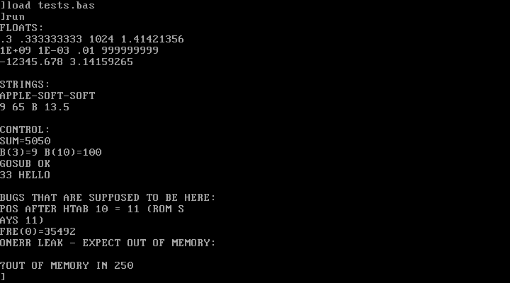

The Turbo Vision front end: the Apple's 40x24 screen in a window, next to a
Machine pane showing the real zero-page pointers, the control stack, and
which ROM bugs are switched on:

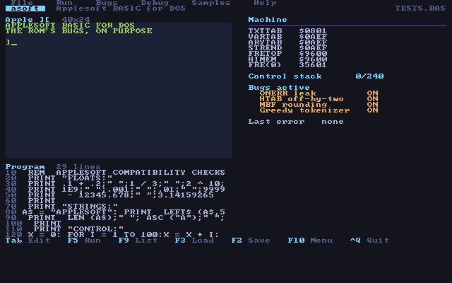

And the point of it all — the sample programs drawn through the hi-res colour
rules, fringes included:


| | | |
|---|---|---|
| 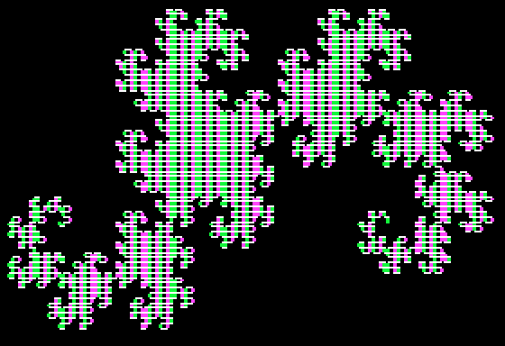 |  |  |
| 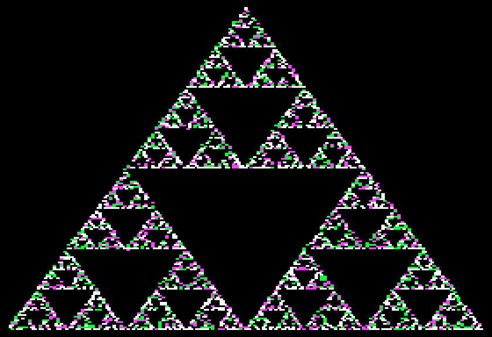 | 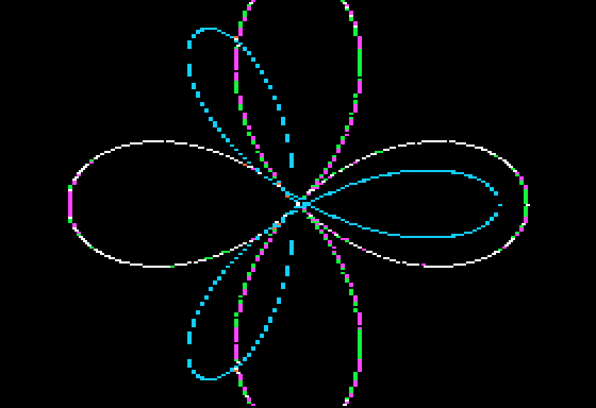 | 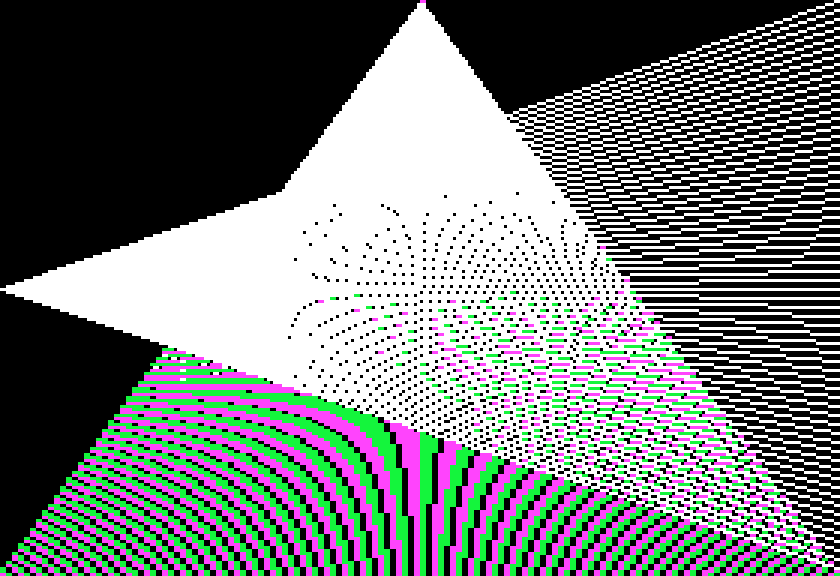 |

Every one is a short Applesoft program from `web/bundle/`, rendered by the
interpreter itself (`tools/hgrdump.c` runs a program and writes the hi-res
page to a BMP).

## Layout

```
src/          the interpreter, portable C89
  mbf.c         5-byte MBF floats: pack, unpack, and Applesoft's PRINT format
  token.c       the ROM keyword table, tokenizer and LIST expander
  a2mem.c       the 64K memory image: program, variables, arrays, strings, GC
  gfx.c         lo-res and hi-res plotting into real page memory
  screen.c      the text screen as a model: cursor, wrapping, window, PR#3
  interp.c      expressions, statements, control stack, ONERR
  panes.c       what the Machine pane says
  bugs.c        which ROM misfeatures are switched on
  main_stdio.c  the console front end for the host: a stream
  main_dos.c    the console front end for DOS: a screen (see below)
  console_dos.c   the text page at $400, the ROM's line editor, the keyboard
  display_dos.c   BIOS text modes and VGA mode 13h, painted from the pages
  main_tv.cpp   the Turbo Vision front end (Borland only; see below)
tests/        unit tests, plus transcript replays against the reference build
tools/
  capture/      the js-dos rig that recorded the reference build's behaviour
  layout.c      draws the whole 80x43 Turbo Vision screen as text
web/          the js-dos host page and bundle
reference/    the original ASOFT.EXE, kept for comparison
```

## Building

The host build needs nothing but a C compiler:

```sh
make          # build/asoft and build/layout
make check    # unit tests and transcript replays
./build/asoft web/bundle/TESTS.BAS
```

`build/layout` draws the Turbo Vision screen as text, from live state, which is
how the pane contents get checked without a Borland toolchain:

```sh
./build/layout -c web/bundle/TESTS.BAS
```

For the 16-bit DOS console build, see `build-dos.sh` (Open Watcom, no install
needed).

### The DOS build's screen

On DOS the console is not a stream, it is the machine's screen. The text page
is the real one at $400 in the memory image, shown through BIOS text mode 1 --
forty columns -- and switched to mode 3 by `PR#3`, back by `PR#0`, with the
wrap, the comma zones and `HTAB` moving with it. `GR`, `HGR`, `HGR2` and `TEXT`
are the video soft switches they always were ($C050-$C057), and the display
follows the switches: mode 13h for the graphics pages, with the bottom four
lines of the text page drawn under a `GR` or `HGR` picture in the Apple's own
font and through the same colour rules as hi-res. `HGR2` is the whole screen,
so there you type `TEXT` blind, as you did. The switches can be flipped by
hand too: `POKE -16302,0` is full screen, `POKE -16301,0` mixed, `POKE
-16299,0` shows page 2 while `HPLOT` keeps drawing on page 1.

Because the page is real memory, everything the machine did with it happens
here: `POKE 1024,193` puts an A in the corner, `GR` then `TEXT` shows the
picture as inverse letters, a scroll moves lo-res pixels along with the text,
`INVERSE` and `FLASH` are stored as the ROM stored them, and a trip through
hi-res and back finds the text exactly where it was. `GR` and `TEXT` park the
cursor on the bottom line and set the text window the way the ROM's `SETGR`
and `SETTXT` did.

`tests/dossim.c` builds this same front end on the host against stand-ins for
the BIOS and the keyboard (`tests/dosshim/`), runs the scenario in
`tests/dossim.txt`, and pins what landed in text video memory in
`tests/dossim.expected`; the graphics frames come out as `build/dossim-*.ppm`.
Run redirected -- `ASOFT.EXE < SCRIPT.TXT > OUT.TXT`, which is what the
capture rig does -- the DOS build is a stream again.

What it looks like, captured from the 16-bit binary running under DOSBox:

| | |
|---|---|
| 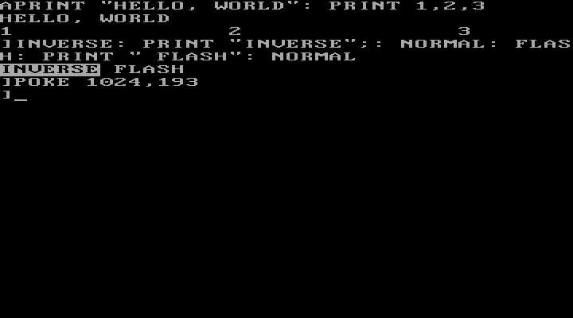 | 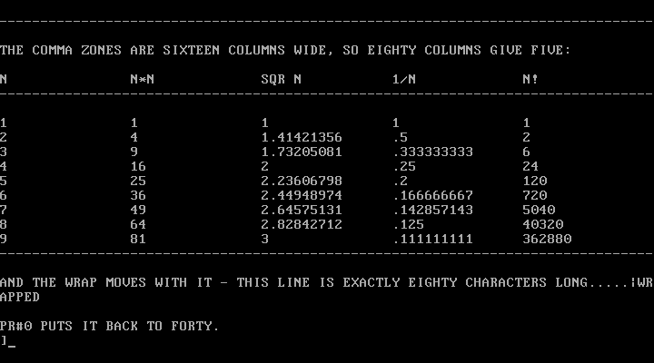 |
| The forty-column screen, BIOS mode 1. `INVERSE` and `FLASH` stored as the ROM stored them; the `A` in the corner is `POKE 1024,193` landing on the prompt. | `PR#3`: eighty columns in mode 3, running `WIDE.BAS`. The comma zones are still sixteen wide, so there are five of them, and the wrap moved to eighty. |
|  | 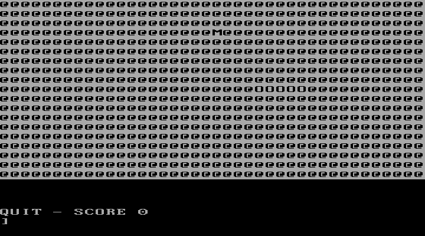 |
| `GR`: `SNAKE.BAS` running in lo-res, mode 13h, with the four-line text window under the picture, empty here because the game has not printed yet. | `TEXT` afterwards. The lo-res bytes are still in the page, so they come up as the inverse `@` the machine showed, with the snake's trail spelling `M` and `O`, and the game's `QUIT` line in the window. |
| 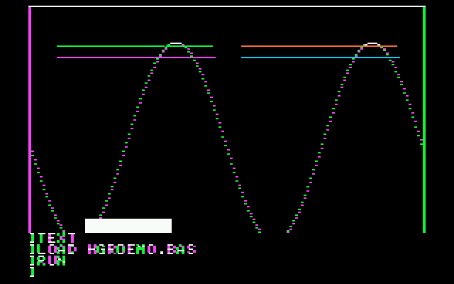 | 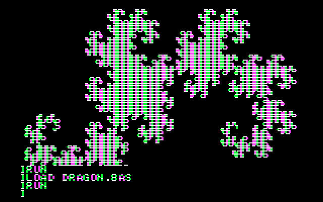 |
| `HGR` is mixed: `HGRDEMO.BAS` with the prompt and the commands that ran it showing in the bottom four lines, in the Apple's font, fringed by the same colour rules as the picture. | `DRAGON.BAS`, flat out. The prompt is back in the text window as soon as it ends, as it was on the machine. |
| 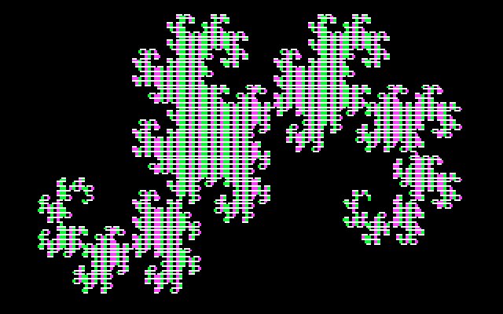 | 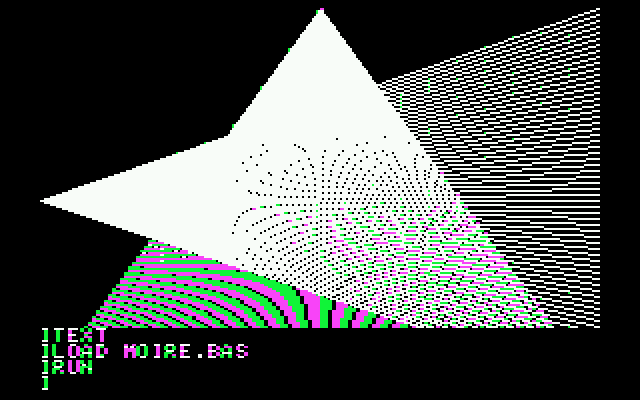 |
| `POKE -16302,0` after that: the mixed switch off, the whole screen to the picture. `HGR2` starts this way. | `MOIRE.BAS`, and the colour the display invents where the dots fall on alternate columns. |

And the same core in the windowed front end, `ASOFTIDE.EXE`, which draws the
page into its Apple pane with half-block characters at two pixels a cell:

| | |
|---|---|
| 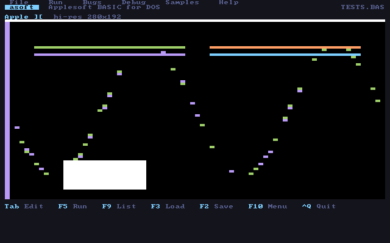 | 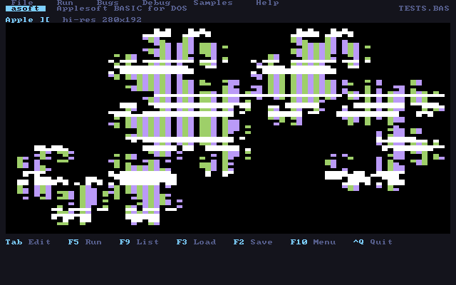 |
| `HGRDEMO.BAS` in the IDE under DOSBox. | `DRAGON.BAS` there, about ten seconds after `RUN`. |

Two frames from the simulation harness rather than the emulator, because they
show a thing the eye cannot check from the outside:

| | |
|---|---|
| 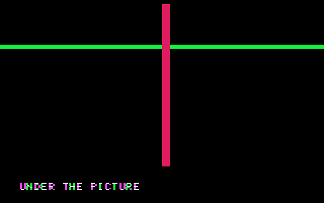 | 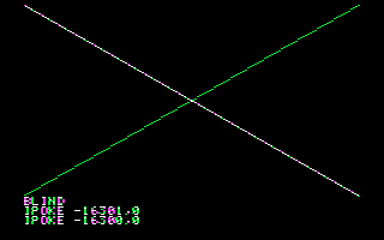 |
| `GR`, a green `HLIN`, a magenta `VLIN`, and a `PRINT` in the window under them: the text is drawn through the artifact rules, so it fringes. | `HGR2` drew on page 2, then `POKE -16300,0` switched the display to page 1: page 1's earlier drawing, with page 2's text still in the window. Double buffering, the way games did it. | For the Turbo Vision build, see `makefile.bc` — that one needs Borland
C++ 3.1 under DOS, because Turbo Vision exists for no other compiler.

### DOS 3.3

Applesoft had no file statements. A program printed a control-D at the start
of a line and a DOS command after it -- `PRINT CHR$(4);"OPEN SCORES"` -- and
DOS, sitting between BASIC and the screen, took the line for itself. `READ`
and `WRITE` then pointed `INPUT` and `PRINT` at the file until the next
command, or a bare control-D, put the screen and keyboard back. That layer is
here (`src/dos33.c`), in the same place in the output path, over the host's
files: text files as `NAME.TXT`, programs as `NAME.BAS`, binary files as
`NAME.BIN` with DOS's own four-byte address-and-length header, all in the
directory the interpreter runs in. `OPEN`, `CLOSE`, `READ`, `WRITE`, `APPEND`,
`POSITION`, `DELETE`, `RENAME`, `CATALOG`, `LOAD`, `SAVE`, `RUN`, `BLOAD`,
`BSAVE`, `PR#` and `IN#` do what they did; `LOCK`, `UNLOCK`, `VERIFY`, `MON`,
`NOMON`, `MAXFILES`, `INIT`, `FP` and `INT` are accepted and do nothing,
because nothing here is a floppy. `EXEC` and `CHAIN` are not there. Typed at
the prompt, `CATALOG` and the rest work without the control-D, and `RUN NAME`
loads and runs.

The errors are DOS's, printed bare as DOS printed them and handed to `ONERR`
with DOS's codes, because programs tested them: `FILE NOT FOUND` is 6, `END OF
DATA` is 5, an unknown command is `SYNTAX ERROR`, 11. `OPEN` on a name that
does not exist creates it, so a `READ` of it hits `END OF DATA` rather than
`FILE NOT FOUND`, exactly as on the machine. `tests/run_dos33.sh` pins all of
this, chaining included: a program that `RUN`s another through the channel.

### The speaker, the printer, and the rest of zero page

`PEEK(-16336)` clicks the speaker, and on DOS that is the PC speaker on port
61h, driven the way the Apple's was: one flip per access, so a program's tone
loops make tones. `CALL -198` and `CALL -1052` ring the ROM's bell. A program
that touches the speaker is making sound in real time, so from then on it runs
at the machine's pace, like one that polls the keyboard.

`PR#1` sends everything printed to the printer until `PR#0`, and on DOS that
is `PRN`, the parallel port, no driver involved. The host build appends to
`printer.txt` instead.

The screen's state lives where the ROM kept it, so the POKEs programs made
work and the PEEKs read back what is in use: the text window at 32 to 35
(`POKE 34,20` keeps a status line clear of the scroll, `POKE 33,33` stops
`INPUT` wrapping), the cursor at 36 and 37, `INVFLG` at 50 (`POKE 50,63` for
inverse), the prompt character at 51, `COLOR=` at 48 and `HCOLOR=` at 228 as
the ROM's own bytes, the page `HPLOT` draws on at 230 (`POKE 230,64` draws on
page 2 while page 1 shows), and the run flag at 214 (`POKE 214,255` makes
every command `RUN`). The Monitor entry points programs `CALL`ed do what they
did: `-936` is `HOME`, `-868` clears to the end of the line, `-958` to the end
of the window, `-1998` and `-1994` clear the lo-res screen, `62450` and `62454`
clear the hi-res page to black or to the current colour, `-3288` pops the frame
`ONERR` leaked. Every other `CALL` is accepted and ignored: there is no 6502
here to run.

## What it needs, and how fast it goes

**On DOS.** An 8086 or anything later: the binaries are built for 8086
instructions only, with 8087 floating point through Open Watcom's emulator, so
no coprocessor is needed. DOS 2.0 or later. About 256 KB of free conventional
memory: the executable is 160 KB, the Apple's memory image is 64 KB, and the
stack is 16 KB. A colour text adapter (CGA or later) for the console's forty
and eighty columns, and VGA or MCGA for graphics, which is mode 13h. The
windowed front end wants EGA or VGA for its 43-line text mode. A parallel port
if you want `PR#1` to print; a speaker for `PEEK(-16336)`.

**How fast.** `BENCH.BAS` is a fixed workload -- arithmetic, strings, an
array, branches, then a hundred and forty hi-res lines -- and `ASOFT.EXE -b
BENCH.BAS` runs it flat out and reports statements a second (`build/asoft -b`
does the same on the host; `tests/run_bench.sh` keeps a floor under it).
Measured with the 16-bit binary under DOSBox at fixed cycle counts, which is
how DOSBox stands in for old machines:

| DOSBox cycles | about the speed of | statements a second |
|---|---|---|
| 3,000 | a 286 at 8 MHz | 339 |
| 20,000 | a 486 at 33 MHz | 2,289 |
| 200,000 | a fast Pentium | 24,638 |
| (native) | this Mac | 7,700,000 |

That is a steady 8.5 DOSBox cycles per statement across the range, so the
numbers extrapolate: an 8088 at 4.77 MHz, at roughly 300 cycles, would run
about 35 statements a second, thirty times slower than the Apple; a 286 at 12
MHz about 450; a 386 at 25 MHz about 1,000.

**What that means.** The interpreter paces itself at the Apple's own rate,
about a thousand statements a second, as soon as a program polls the keyboard
or the speaker, so games and anything with sound play at the speed they were
written for. Holding that pace needs about 1,000 statements a second of
headroom, which is a 386 at 25 MHz or a 386SX at 33: on anything slower the
program simply runs as fast as the machine can, and a 1983 PC with 640 KB
runs everything but runs it slowly, an XT at a thirtieth of Apple speed, an
AT at half. The compute-bound demos are a different question: they run flat
out, and the dragon curve's hundred thousand statements take four seconds on a
486, forty on a 286, and about an hour on an XT, next to two minutes on the
Apple itself. `web/bench.html?cycles=N` runs the benchmark in the browser at
any cycle count, which is where the table came from.

## Other people's programs

`tools/corpus.py` runs a directory of third-party Applesoft programs and
reports what breaks, and `tools/dsk2bas.py` pulls the tokenised programs out
of DOS 3.3 disk images so those can go in too. A first pass over 107 real
programs -- AppleTrek, two Lemonade Stand ports, Oregon Trail, a KansasFest
demo, and the BASIC Computer Games conversions -- found four things the
interpreter got wrong, each now fixed and pinned in `tests/local/rom.txt`
and `tests/local/formats.txt`:

- A `FOR` loop left by a `GOTO` and entered again does not nest. The ROM
  looks back through the FOR frames for one on the same variable and throws
  it and everything above it away; without that, five of the games ran out
  of memory on their main loop.
- An array used before `DIM` gets 0..10 in every subscript, not the
  subscript it was first used with. `F(1,1)=0: F(1,2)=0` is legal.
- `LOMEM:` moves the bottom of variable space. It was moving the program.
- Text files with bare CR line endings, which is what an Apple wrote, and
  listings that went through a printer with their long lines wrapped and
  indented, both load.

What is left in that corpus is the machine's, not ours: `IF C>A THEN` is a
syntax error because the tokenizer finds `AT` in it, `FOR DELAY=` finds
`DEL`, `HLIN 0,79` is an illegal quantity on a forty-column lo-res screen,
and the rest are programs for other BASICs (`CLS`, `WIDTH 80`) or the
canned answers the harness types at `INPUT`.

The hi-res games in the images (Chicken Little, Mosquito Madness, Pond Scum,
Spin Ball) `BLOAD` machine code and `CALL` it, which needs a 6502 this does
not have.

## Where the behaviour came from

The archive this started from contained a working `ASOFT.EXE` and no `src/`.
Rather than guess at the ROM from memory, the binary was run under js-dos and
its behaviour recorded: `tools/capture/` pipes a script through the interpreter
inside DOSBox, reads the transcript back out of the emulator's filesystem, and
`tests/run_capture.sh` replays the same script through this build and diffs.

That is what settled the things nobody should guess at — that `LIST` prints
keywords as `" KEYWORD "` and drops the spaces you typed, that the `]` prompt
does not count towards the 40-column wrap, that `DIM B(10)` costs 62 bytes,
that the ONERR leak is exactly sixty deep. `tools/capture/README.md` lists the
measurements.

Replaying `TESTS.BAS` currently matches the reference on 61 of 62 lines, and
the wide regression matches on all 33.

## Verified against the genuine ROM

The reference build pins regressions, but it is a binary of this same
project's ancestor, not an Apple II. `tools/diff/` closes that gap: it runs a
corpus of Applesoft programs through this interpreter and through the real
Applesoft ROM — [bobbin](https://github.com/micahcowan/bobbin), a terminal
Apple \]\[+ emulator with the genuine firmware — and diffs the output.

```sh
BOBBIN=/path/to/bobbin python3 tools/diff/run.py
```

Nineteen programs cover number formatting, transcendentals, strings, control
flow, `DATA`/`READ`, `DEF FN`, arrays, `POS`/`HTAB`, `ONERR` and the error
codes at `PEEK(222)`, the tokenizer, `FRE(0)` and the zero-page pointers, and
a few real workloads. **Seventeen of the twenty are byte-identical to the
ROM**, error messages, memory sizes and `?BAD SUBSCRIPT ERROR IN 60`
included. The harness has already earned its keep twice:

- Error messages here were missing the ROM's ` ERROR` suffix —
  `?OUT OF DATA IN 250` against the machine's `?OUT OF DATA ERROR IN 250`.
  Fixed.
- The "HTAB off-by-two" misfeature this project used to reproduce **does not
  exist**. The genuine ROM answers `HTAB 10 : PRINT POS(0)` with 9, exactly
  where it should be. The bug was folklore, faithfully implemented; it has
  been removed, and `POS` now matches the hardware.

The three that still differ, and why:

- **`SIN`/`COS`/`ATN`** disagree with the ROM in the ninth significant digit
  on some arguments — this build computes them in host precision and rounds,
  where the ROM ran its own polynomials in 5-byte floats. The ROM's
  `ATN(1) * 4` is `3.14159266`; this build says `3.14159265`, which is
  correct and therefore wrong. Matching bit-for-bit means reimplementing the
  ROM's polynomial evaluation in MBF arithmetic.
- **`RND`** is not the ROM's generator, so seeded sequences differ.
  `RND(0)` repeating the last value does match.

## Known differences from the reference build

Deliberate, except the first:

| | this build | reference |
|---|---|---|
| `FRE(0)` after `TESTS.BAS` | 35492 | 35491 |
| `PRINT 1E-5` | `1E-05` | `-4` |
| `LEFT$("ABC",0)` | `""` | `?ILLEGAL QUANTITY` |
| `LOAD`, `SAVE`, calling `DEF FN` | work | `?SYNTAX ERROR` |
| `PLOT`, `HPLOT` | draw into page memory | parsed and ignored |

The `FRE(0)` byte is the one unexplained difference. Every allocation rule was
measured and matched — program storage is byte-exact line by line, scalars cost
7, arrays 7+5n, literals cost nothing, `READ` copies — so what is left is a
single byte of collector residue inside a binary whose source is gone.

`PRINT 1E-5` printing `-4` is the reference stopping after the `E` and reading
`-5` as subtraction. The ROM accepts signed exponents, so this build does too.

## The bugs, and switching them off

`bug_enabled[]` in `src/bugs.c`, the **Bugs** menu in the Turbo Vision build,
or `./build/asoft -n` to disable all three.

- **ONERR leak.** Every trapped error pushes a frame that is never popped.
  240 bytes of control stack, 4 bytes a time, so the sixty-first error is
  fatal. `CALL -3288` pops one, which is what `ONERRFIX.BAS` demonstrates.
- **MBF rounding.** Results are rounded to a 32-bit mantissa after every
  operation. Switch it off and `.1 + .2` stops printing as `.3`.
- **Greedy tokenizer.** Keywords match anywhere, so `TOTAL = 5` tokenizes as
  `TO TAL = 5`. Switching it off costs you `FORI=1TO10`, which then needs its
  spaces.

## Status

The interpreter, the console front end and the web bundle work and are tested.
`src/main_tv.cpp` has **not been compiled** — there is no 16-bit Borland
toolchain here and Turbo Vision does not build under Open Watcom, so it is
written to the API but unverified. Its pane contents and layout are checked
separately through `panes.c` and `tools/layout.c`.

Shape-table `DRAW`/`XDRAW`, sound, and `PR#`/`IN#` are parsed and ignored.

## Running other people's programs

`tools/corpus.py <directory>` runs a pile of third-party Applesoft programs
and reports what breaks. The corpus is not in this repository -- it is other
people's code under their own licences -- so clone some and point the tool at
it. It is not a pass/fail suite: many of those programs are interactive, or
expect a disk, and stopping early is often correct. What it is good for is
finding places where this interpreter refuses something real Applesoft
accepted, because a syntax error in a program that ran on the hardware is a
bug here, not there.

Over 116 programs from eight repositories it found four, all since fixed:

- **`?` was not PRINT.** Applesoft stores `?` as the PRINT token, so a program
  typed with `?` lists back as though it never had one.
- **`NOT` was only usable at the head of an expression**, so
  `POKE 49236 + NOT SC,0` -- real code -- was a syntax error. It is a unary
  operator wherever a term can start, taking its operand at relational
  precedence.
- **`ATN` came apart into `AT` + `N`.**
- **`A TO 3` came apart into `AT` + `O3`.** Keyword matching ignores spaces,
  which is how `PR INT` becomes PRINT -- and is exactly why `A TO` matched AT
  across the gap. The ROM resolves it by looking at what follows a matched
  AT: an N means the word was ATN, an O means it was really TO.

A fifth thing it found was not a bug but a missing feature: `NEXT I,J`. Real
Applesoft has always taken a list of variables there and programs written for
real machines use it, so that is implemented -- see the note below, because it
is the one place this deliberately parts company with the reference.

Six programs still fail, and none of them is a bug here: one relies on `DIM A`
without a subscript, which the reference rejects too; one is defeated by the
greedy tokenizer, which is a deliberate ROM bug and which `-n` gets past; one
is Microsoft BASIC (`DEFINT A-Z`); one uses string `DEF FN`, which Applesoft
has never had; and two are wrapped listings rather than source, their DATA
statements continued across lines with no line number.

### Answering the prompts

`--feed` answers INPUT and GET instead of closing stdin, which is the
difference between a program stopping at its first question and actually
running. It roughly doubles what gets exercised: `do_input`, the keyboard
strobe, `ONERR`, and the long tail of a program's own logic.

Fed input, the same 116 programs give 50 clean runs, 22 that raise an error
inside a program, and 44 still going when the clock runs out -- mostly games
waiting for a better answer than a canned one. Every one of the 22 is
accounted for:

- **13 syntax errors**, all of them the greedy tokenizer doing its job or code
  that was never Applesoft. `INWORD` becomes `INW OR D`, `renew` becomes
  `re NEW`, `elevation` becomes `elev AT ion`, `score` becomes `SC OR E`. So
  does `IF NOT A THEN`, which is worth knowing: `A THEN` matches AT across the
  space and leaves `HEN`. The reference does exactly the same thing, byte for
  byte -- a variable called `A` in front of `THEN` really did break on the
  hardware, and only `TO` and `ATN` get rescued.
- **5 bad subscripts**, from canned answers steering past the ten elements an
  undimensioned array gets. Auto-dimensioning itself works.
- **3 out of memory**, two of them genuinely enormous -- `DIM L(128,24,2)` and
  `DIM P(64,2,70,3)` do not fit in a 64K image, and did not fit in a real one.
- **1 out of data**, a program reading past its DATA.

Nothing in that list is an interpreter bug. Re-entering a FOR was checked
separately, since a loop exhausting memory would have been one: 200 re-entries
of the same loop variable reuse the frame rather than stacking up.

### The bugs earn their keep

Turning the ROM bugs off makes *more* programs fail, not fewer -- 28 against
6. The greedy tokenizer is why: matching keywords anywhere is what lets
`FORI=1TO3` be read as `FOR I = 1 TO 3`, and period programs are written
without spaces because the machine did not need them. Switching it off buys
you `TOTAL` as a variable and costs you every program that ran the words
together. The default is the authentic one, and it is also the one that runs
more real code.

## Where it differs from the reference

Three places, all measured rather than assumed:

Two of them are deliberate, and both follow the hardware rather than the
reference. Neither can be checked against it, so their expectations are
written down in `tests/local/` instead.

- `NEXT` takes a list of variables here -- `NEXT J,I` closes both loops -- and
  the reference takes only one. Real Applesoft has always accepted the list,
  and programs written for real machines depend on it.
- After `ONERR` traps, `PEEK(218) + 256 * PEEK(219)` gives the line the error
  happened on. The reference gives the line `ONERR` was pointed at instead,
  which is of no use to the handler and is not what the machine did.

A third difference is not a divergence but a bug in the reference: `2 ^ 200`
hangs it. Overflow raises `?OVERFLOW` here, as it should.

- `FRE(0)` reads one byte higher than the reference: 35492 against 35491, one
  byte of collector residue.
- `ATN` differs by one in the ninth significant digit on some arguments --
  `ATN(1)` gives .785398163 against the reference's .785398164. Every other
  function matches exactly. The reference is not using the host's `atan`, nor
  the Applesoft ROM's polynomial: neither reproduces its values, and the
  differences run in both directions, which is the signature of some third
  approximation. Twelve sampled arguments were not enough to identify it, so
  this is left as a known difference rather than guessed at.

The tokenizer bug behind `ATN` was real and is fixed: `AT` is a prefix of
`ATN` and the table listed `AT` first, so `ATN(1)` came apart into `AT`
followed by the variable `N`. Keyword matching now takes the longest match
rather than the first. That does not soften the deliberate greedy bug, because
`TOTAL` is not itself a keyword and still becomes `TO` + `TAL`.

## Graphics

`GR` and `HGR` write into the Apple's page memory, laid out the way the
hardware wanted it rather than the way anything wants to draw it: hi-res rows
are interleaved in three groups of eight, with eight unused bytes at the end
of each group. `PEEK` sees exactly what the machine would have seen.

Two front ends display those pages. The DOS build uses VGA mode 13h, where
320x200 holds hi-res (280x192) with a border and lo-res (40x48) at exactly 8x4
per cell; plotted pixels go straight to video memory as they happen, and a
`POKE` or a screen clear triggers a full repaint. The native build draws the
same pages with terminal half-blocks.

### Colour is a property of position

`HCOLOR` does not choose a colour so much as a bit pattern. Green lights only
odd columns and violet only even ones, so a single green dot at an even `x`
draws nothing at all. The pixel clock ran at the colour subcarrier frequency,
so where a dot sat decided what came out of the display:

- a lit pixel reads white if either neighbour is lit
- a lone dot fills a whole colour cycle, and so is two screen pixels wide

Which is why `HPLOT 0,0 TO 0,191` in white comes out **violet**: a one-pixel
vertical line has no horizontal neighbour, so it takes its column's colour. On
an odd column the same line is green. That is the hardware, not a bug, and it
is why hi-res art is full of two-pixel-wide strokes.

The widening happens in the rasterizer rather than in the plot, so page memory
stays honest: `PEEK` still sees the single bit that was set.

### Shape tables

`DRAW`, `XDRAW`, `ROT=` and `SCALE=` work. A shape is a string of moves packed
three to a byte -- two that can plot and a third that only moves -- and a zero
byte ends it. The packing rules are awkward, because a section cannot always
hold what you want without the byte reading as the terminator; `tools/mkshape.py`
encodes vectors into a table and emits the `DATA` statements.

`ROT=` and `SCALE=` live in zero page at $F9 and $E7, so `POKE 249,16` and
`ROT=16` are the same thing. `SCALE=0` means 256, not "no scale". Every plot
that lands on an already-lit pixel bumps the collision counter at $EA, so a
program can tell that two shapes overlap without reading the screen back.

One deliberate divergence: the ROM only turns cleanly at the quadrants, and in
between walks a distorted version of the shape that depends on the scale.
`ROT=` here rounds to the nearest quadrant instead -- right on the multiples of
16 that programs actually use, an approximation elsewhere.

### Programs

Fifteen ship in `web/bundle`, and the IDE's Samples menu loads any of them in
one pick. Most want `-f`; see Speed below. From a shell:

    ./build/asoft -f -r web/bundle/MANDEL.BAS  # banded by escape time
    ./build/asoft -f -r web/bundle/JULIA.BAS   # a dendrite, same banding
    ./build/asoft -f -r web/bundle/FERN.BAS    # Barnsley, four affine maps
    ./build/asoft -f -r web/bundle/DRAGON.BAS  # turns taken from the step number
    ./build/asoft -f -r web/bundle/SIERP.BAS   # Sierpinski, by the chaos game
    ./build/asoft -f -r web/bundle/SPIRO.BAS   # hypotrochoids
    ./build/asoft -f -r web/bundle/MOIRE.BAS   # interference
    ./build/asoft -f -r web/bundle/CUBE.BAS    # a rotating wireframe
    ./build/asoft -f -r web/bundle/WIDE.BAS    # eighty columns, from PR#3
    ./build/asoft -r web/bundle/SNAKE.BAS      # I J K M to steer, Q to quit

Mandelbrot and Julia are banded by escape time into the four hi-res colours,
which is exactly the palette Apple II fractal art of the period had to work
with. The dragon curve walks itself twice -- once to find its size, once to
draw it scaled to fit -- so it fills the screen whatever order you give it.

Two of them are worth reading rather than only running. JULIA.BAS carries a
comment about why its row variable is `YY` and not `ZY0`: only two characters
of a name are significant, so `ZY0` *is* `ZY`, and each row would eat its own
starting value. CUBE.BAS explains why its eye is six units back rather than
four -- a rotated unit cube reaches SQR(3), and any closer the perspective
divide throws a corner off the screen and Applesoft stops with ILLEGAL
QUANTITY.

### The keyboard, for games

`GET` stops and waits, which is no use to anything that has to keep moving.
Programs of the period polled the keyboard soft switches instead, and those
work here: `PEEK(-16384)` returns the last key with bit 7 set while it is
unread, and `POKE -16368,0` acknowledges it. SNAKE.BAS is built on that, so it
keeps going while you decide where to turn.

Both front ends are tested against a real terminal for this, because a pipe
cannot show it: `tests/run_cli_keys.sh` drives the console build under a pty
and `tests/run_ide_keys.sh` drives the windowed one, and in each case a
running program has to see a key pressed while it runs. The game test asks for
Q, which ends differently from running into a wall, so QUIT rather than GAME
OVER is what proves the key arrived.

## Speed

The interpreter runs at the speed the machine ran at: about a thousand
statements a second, which puts `FOR I=1 TO 1000: NEXT` at a second and a
half, the same as an Apple II.

That is not nostalgia. Applesoft has no clock, so a program that wants to wait
counts to a number in a `FOR` loop, and how long that takes is a property of
the hardware. Run it flat out and a game crosses the screen before you can
press a key, and the delay constant that made it playable becomes meaningless
-- right for one machine, wrong for every other. Pacing the interpreter is
what lets a program's own timing loops mean the same thing on a laptop, under
DOSBox, and on a real DOS machine. SNAKE.BAS says `SP = 100` and that is
simply how long it waits, everywhere.

    ./build/asoft -f program.bas       # flat out
    ./build/asoft -s 5000 program.bas  # five thousand statements a second

Anything compute-bound wants `-f`: the Mandelbrot is a couple of hundred
thousand statements, which is four minutes at the machine's own pace, and was
four minutes on the machine too. `build/hgrdump` and `build/textdump` are
unthrottled already, since they are rendering a picture rather than pretending
to be a machine.

`build/hgrdump program.bas out.bmp [scale]` renders a program's graphics page
to a file, which is how the colour rules are checked without squinting at a
terminal.

While hi-res is up the DOS build prints nothing at all, because that is what
the Apple did: the prompt went to the text page, which was not the page on
screen. Type `TEXT` blind and press return to get back. The terminal build
does not do this -- it has only one screen, and hiding the prompt there would
just look broken.

## Licence

MIT; see [LICENSE](LICENSE).

Two things in the tree are not mine to relicense, and are worth knowing about
before publishing:

- `reference/ASOFT-watcom-reference.EXE` is the compiled binary this is
  checked against, from the original archive. Everything in `tools/capture`
  exists to run it and compare, so removing it costs the capture tests --
  they skip rather than fail without it.
- The corpus of third-party Applesoft that `tools/corpus.py` runs is *not* in
  this repository, deliberately: it is other people's programs under their own
  licences. Clone them wherever you like and point the tool at them.

The character set in `src/applefont.c` is authored to the Apple's 5x7-in-7x8
geometry rather than copied: the real character ROM is still Apple's.

---

Applesoft and Apple II are trademarks of Apple Inc. This project is not affiliated with or endorsed by Apple. The character shapes, the keyword table and the behaviour described here were authored or measured for this project; no Apple ROM code or data is included.
